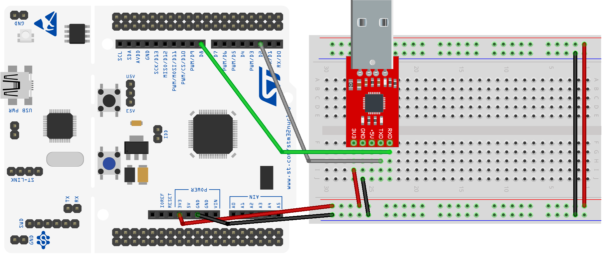

# USART Example for STM32F446RE

This project demonstrates how to use the USART port for STM32F446RE connected to the serial port of a computer.

The code uses the USART1 port. The port is configured to use the following settings:

| Parameter    | Value                       |
| ------------ | --------------------------- |
| Baudrate     | 1200                        |
| Data bits    | 8                           |
| Stop bits    | 1                           |
| Parity       | None                        |
| Flow control | None                        |
| Mode         | TX and RX (with interrupts) |
| USART        | USART1                      |
| Pins         | PA9 (TX) and PA10 (RX)      |

When the program starts it sends the string "Hello World!" to the serial port. When the string has been sent the program waits for a character to be received. When a character is received it it is printed out for debug purposes only. You can see the ITM output echoing the received characters.

This project is intended to be used with the MatrixMCU toolkit. The toolkit is available at GitHub: [MatrixMCU](https://github.com/sdg2DieUpm/MatrixMCU).

Click on the image to see the video showing the USART example for Nucleo STM32:

## Getting Started

Download this project and place it in the `projects` folder of the MatrixMCU toolkit. 

### Prerequisites

Be sure that you fulfill the prerequisites of the MatrixMCU toolkit and it is up to date.

If you want to use the serial monitor shown in the video you can to install the VSCode extension [**Serial Monitor**](https://marketplace.visualstudio.com/items?itemName=ms-vscode.vscode-serial-monitor) of **Microsoft**.

## Authors

* **Josué Pagán** - email: [j.pagan@upm.es](mailto:j.pagan@upm.es)

## License

This project is licensed under the MIT License - see the LICENSE file for details.

## Acknowledgments

* **Román Cárdenas** - email: [r.cardenas@upm.es](mailto:r.cardenas@upm.es)
* **Amadeo De Gracia** - email: [amadeo.degracia@upm.es](mailto:amadeo.degracia@upm.es)